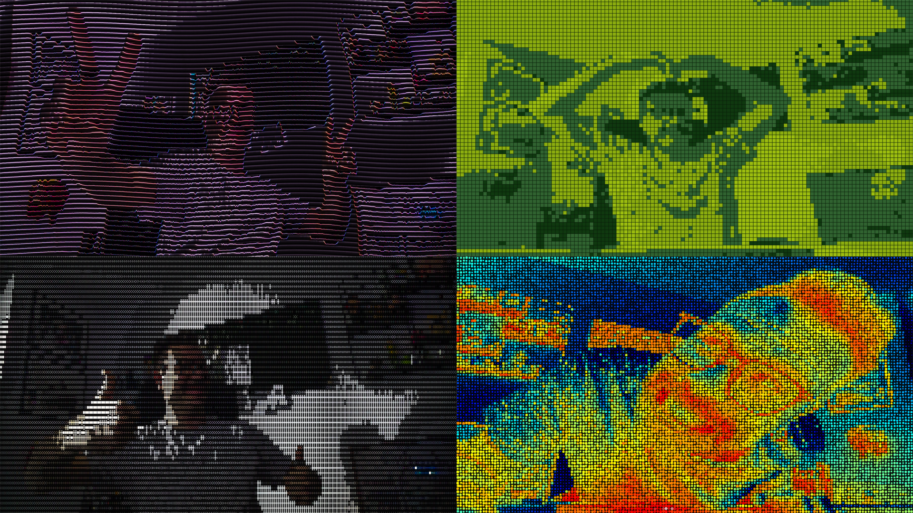

# Retina Cannon




> "What if I took the live camera feed and ran it through a shader that makes everything look like a 1970s vector art fever dream?"
> _Someone who had clearly watched too many Rutt-Etra videos at 2am and owned a bunch of unused Raspberry Pis_

**Retina Cannon** is a real-time camera-to-shader visual engine for Raspberry Pi. Because, why not? WHY NOT?!?1! 🙃

This is not a camera filter app. Camera filter apps have sliders and a share button. This has a GLSL pipeline, a bare-metal DRM/KMS renderer, and a keyboard thread that intercepts Ctrl+C before the OS even knows it happened.

It grabs live video from the Pi Camera, feeds every frame into a fragment shader running on the GPU, and blasts the result fullscreen: no X server, no compositor, no display manager asking if you're sure. Just OpenGL ES talking directly to the display hardware, the way it was meant to be.

---

## Why this exists

Like most Raspberry Pi projects, this one started with a purchasing decision that seemed completely reasonable at the time.

The logic goes like this: *"I already have three Pis, but this one will be different: I'll use it as a dedicated Doom server / home NAS (I already have a NAS) / weather station for a city I don't live in / automatic cat feeder (no cat) / retro gaming console (will play it twice) / AI assistant that listens to everything I say (fine, maybe not that one)."*

Four Pis later, they sit on the desk. They don't say anything. They just look at you. Judgmentally. With their little red power LEDs.

At some point the only reasonable response is to give one of them a camera, a monitor, and a reason to live. Hence: Retina Cannon.

**The actual use case** is beautifully stupid: print a nice 3D-printed enclosure *(files coming soon)*, walk into a friend's place with a 100-inch TV doing absolutely nothing, plug in AC + HDMI, and suddenly you're the most interesting person at the party. No streaming service. No game console. Just a $40 computer turning your guests into glitchy CRT sculptures in real time.

**What's coming:** encoder knob and gesture controls, already prototyped on breadboard. Audio-reactive shaders, once the microphone is mounted. The todos are real. The timeline is optimistic. You know how it goes.

---

### TL;DR

*(Sprinkled with emojis because let's face it: reading is hard, and a proper TL;DR needs them—kind of like a toddler needing a picture book instead of actual text).*

* 📷 **The Pipeline:** Live Pi Cam → one GLSL Shader → Bare-Metal GPU. No desktop environment, no X11 bloat, zero compositor bullshit. Just pure graphical violence injected straight into the display hardware.
* ⌨️ **The Controls:** Mash `Space` to cycle through 5 reality-bending shaders. Arrow keys for live tweaks. `V/M/F/S` for View, Mirror, FPS, and Screenshots.
* 🚀 **The Execution:** Run `./start_cannon.sh`, point the lens at a human face, and instantly generate pretentious living-room glitch art.
* 💥 **The Dependencies:** You need a Raspberry Pi, a camera, and `kms-glsl`. If `glsl.so` is missing, the whole thing violently crashes and burns on launch. As it rightfully should.
* 🔌 **The Flex:** Plug in HDMI + AC at a party, step back, and let everyone assume you spent six agonizing weeks coding a custom cyber-art installation.

---

## Effects

Eight effects, all in a single shader, switchable live with `Space`:

### Rutt-Etra CRT

In 1973, [Bill Rutt and Steve Etra](https://en.wikipedia.org/wiki/Rutt/Etra_Video_Synthesizer) built an analog video synthesizer that deflected scan lines based on the luminance of the incoming signal. It cost as much as a car, weighed as much as a refrigerator, and produced visuals that looked like the world was made of oscilloscope traces.

This is the same thing. In GLSL. On a $40 computer. Running at 20 FPS.

Frame luminance warps the scan lines. CRT curvature bends the edges. Vignette darkens the corners. Noise adds grain. Your face becomes a vector field.

**Color modes:** `B/W` · `Colors` · `Prism Warp` · `Acid Melt`

### ASCII Cam

Every camera pixel gets mapped to a glyph from an 8x8 bitmap font hardcoded inside the shader. Luminance picks the character. The whole thing runs on the GPU in real time, with no CPU involvement in the actual rendering.

**Color modes:** `Color symbols` · `Monochrome symbols` · `Inverted mono` · `Inverted color`

### Pixel Art

The camera downsampled to a grid of blocks, each rendered as a single pixel of a retro palette. The block size is tunable from near-native (4px) to aggressively chunky (48px). Cycling Pixel color mode applies a per-mode default size first, then `←` / `→` still tweak live.

| Mode | Look |
|---|---|
| Full Color | Pixelated camera, BGR corrected |
| Game Boy | DMG-01 four-shade green + authentic LCD pixel gap |
| CMYK Melt | Cyan/magenta/yellow/black print chaos with ordered dither |
| Toxic Candy | Neon candy palette with aggressive quantization |

### Raster Vision

Dedicated halftone/raster effect (separate from Pixel Art): thermal and comic looks rendered as variable-size dots.  
`←` / `→` controls raster cell size (bigger = fewer/larger dots, smaller = denser dots).

| Mode | Look |
|---|---|
| Thermal Raster | Blue-cold / red-hot raster dots |
| Thermal Inverted | Red-cold / blue-hot raster dots |
| Comic B/W | Black-ink halftone + edge lines |
| Comic Pastel | Soft posterized pastel halftone |
| Vibrant Pop | Saturated comic-print style |

### Signal Ghost

Interactive generative typography. A field of letters that lives and breathes with your presence.

The capture loop runs motion detection and presence estimation at 1/8 resolution on the CPU — cheap enough to run every frame without touching the GPU budget. The results drive four GLSL uniforms:

- **`uMotionLevel`** — frame-diff magnitude, dead-zone filtered, asymmetrically smoothed (fast attack, slow decay so gestures linger visually)
- **`uPresenceScale`** — overall scene luminance, a proxy for how close you are
- **`uPresenceCX/CY`** — weighted centroid of bright regions: where you are in the frame

At rest: small letters, slow breathing. When you move: letters burst with per-cell staggered timing, creating a wave across the field rather than a uniform explosion. When you approach: letters near your centroid amplify their reaction.

| Mode | Look |
|---|---|
| Void | White glyphs on black, minimal |
| Matrix | Classic green terminal |
| Ghost Cam | Letters tinted by camera, faint camera ghost background |
| Neon | Per-cell hue that shifts on motion |
| Thermal | FLIR jet coloring per local luminance |
| Chromatic | RGB channels split by motion intensity |

### Datamosh Trails

Aggressive live smear/glitch pass: motion-like edge drift, ghosted copies, and channel split.

**Color modes:** `Trails`

### VHS Tracking Burn

Analog tape chaos: horizontal tracking drift, chroma bleed, scanline flicker, and random dropouts.

**Color modes:** `Tracking Burn`

### Posterize Glitch Comic

Hard quantization + edge ink + mild RGB split, for instant printed-comic meltdown vibes.

**Color modes:** `Comic Glitch`

---

## How it works

```
Pi Camera (BGR888, 1640x1232)
    │
    │  Picamera2 + libcamera
    ▼
capture thread ──(threading.Lock)──▶ latest frame
    │                                      │
    │  motion detection (1/8 res)    C render loop (kms-glsl)
    │  uMotionLevel, uPresence*             │
    │                                Python render callback
    │                                      │
    └──────────────────────────────▶ glTexSubImage2D + uniforms
                                           │
                                    GLSL fragment shader
                                           │
                                    DRM/KMS output (fullscreen)
```

**Capture**: a daemon thread runs continuously, keeps the latest frame behind a lock, and computes motion/presence data at 1/8 resolution on the side — negligible CPU cost.

**Render**: `kms-glsl`'s C loop fires a Python callback every frame. The callback uploads the texture and pushes all uniforms to the GPU.

**Shader**: all visual logic lives in `rutt_etra.frag`. One fragment shader, four completely different visual systems, routed by `uEffectMode`.

**Keyboard**: a separate thread reads `/dev/tty` in raw mode (`ICANON`, `ECHO`, `ISIG` all disabled). Ctrl+C arrives as `\x03` bytes and triggers graceful shutdown. `SIGTERM` and `SIGHUP` are also handled — kill from SSH works cleanly.

**stdin**: replaced with a silent pipe at startup so `kms-glsl`'s C code doesn't mistake terminal activity for user input. The write end doubles as the shutdown signal mechanism.

---

## Requirements

- Raspberry Pi with camera support enabled
- `python3`, `libcamera`, `picamera2`, `numpy`
- [`kms-glsl`](https://github.com/keithzg/kms-glsl) in one of:
  - `KMS_GLSL_DIR` environment variable
  - `../kms-glsl` sibling directory (recommended)
  - `~/kms-glsl`

Recommended layout on the Pi:
```
~/kms-glsl/       ← external dependency
~/retinacannon/   ← this repo
```

Detection looks for `glsl.so` inside the candidate directory. If not found, the launcher prints `[FATAL]` and exits.

---

## Run

```bash
./start_cannon.sh
```

Specific shader:
```bash
./run_rutt.sh     # Rutt-Etra (default)
./run_base.sh     # raw camera passthrough
```

Non-standard `kms-glsl` location:
```bash
KMS_GLSL_DIR=/path/to/kms-glsl ./start_cannon.sh
```

Kill cleanly from SSH (when DRM has taken over the local terminal):
```bash
kill -SIGINT $(pgrep -f retina_cannon.py)
```

---

## Controls

| Key | Action |
|---|---|
| `Space` | Cycle effect: Rutt-Etra → ASCII Cam → Pixel Art → Signal Ghost → Raster Vision → Datamosh Trails → VHS Tracking Burn → Posterize Glitch Comic |
| `S` | 3-second countdown then save rendered screenshot to `shots/` |
| `↑` / `↓` | Cycle color mode (per-effect, independent) |
| `←` / `→` | Rutt: wave intensity · ASCII: char density · Pixel: block size · Ghost: field density · Raster: dot size · Datamosh: amount · VHS: tracking · Poster: levels |
| `V` | Cycle view: 16:9 → 4:3 → Fisheye |
| `M` | Toggle horizontal mirror of current view |
| `F` | Toggle FPS logging to terminal |
| `Ctrl+C` | Clean shutdown |

Arrow keys handle both `ESC [` and `ESC O` prefixes. Because terminal emulators are ungoverned.

### Screenshot Mode (`S`)

Press `S`, get a dramatic 3-second terminal countdown, then a frame dump of whatever glorious visual chaos is on screen.

Files are saved to `shots/` as:
`YYYYMMDD_HHMMSS_<effect>_<variant>_<view>_mirror-(on|off).png`

So yes, your shader experiments are timestamped evidence now. Very professional.

---

## Startup / Shutdown

On boot, after camera and GL init:
- Logo appears line-by-line (scan effect)
- System status box: hostname, SoC temperature (color-coded), RAM, uptime, active shader, effect
- Random nerd quote from a curated list

On shutdown: clean logo + session stats (duration, estimated frames rendered, average FPS).

---

## Defaults

| Parameter | Value |
|---|---|
| View mode | 16:9 |
| Mirror | ON (because the camera should stop gaslighting you) |
| Rutt color | Prism Warp |
| ASCII color | Color symbols |
| Pixel Art color | Game Boy |
| Signal Ghost color | Void |
| Raster Vision color | Thermal Raster |
| Rutt wave | 0.40 |
| ASCII density | 3.00 |
| Pixel block size | 16px |
| Ghost field density | 2.0 |
| Raster dot size | 12px |
| FPS baseline | ~20 FPS |

---

## Notes for developers

**`c_float()` is not optional.** Float uniforms via ctypes must be explicitly wrapped or the GPU gets garbage.

**The GIL is load-bearing.** Globals like `current_rutt_wave` are written by the keyboard thread and read by the render callback with no explicit locking. CPython's GIL makes these reads atomically safe. Port to free-threaded Python and add locks.

**Never use SIGTERM/SIGKILL to stop the process.** Both are now handled gracefully (SIGTERM → same clean shutdown path as Ctrl+C), but a SIGKILL will leave DRM in an exclusive state that may survive a soft reboot and require a hard power cycle.

**Testing without Pi hardware** will fail immediately. `Picamera2` won't import, EGL won't initialize, `kms-glsl` will complain. This is correct.

Syntax checks that work anywhere:
```bash
python3 -m py_compile retina_cannon.py
bash -n start_cannon.sh
```

---

## License

MIT - [Netmilk Studio sagl](https://netmilk.studio)

Do what you want with it. Attribution appreciated. Don't blame us if it runs at an art show and someone asks you to explain what a fragment shader is.
